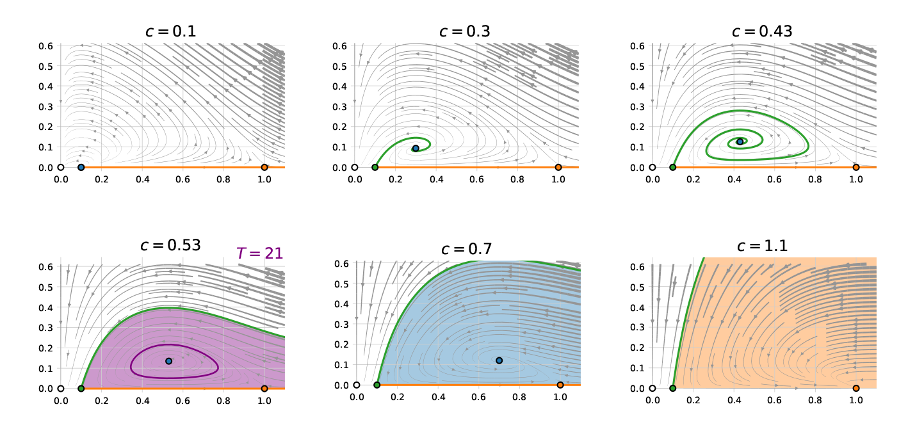
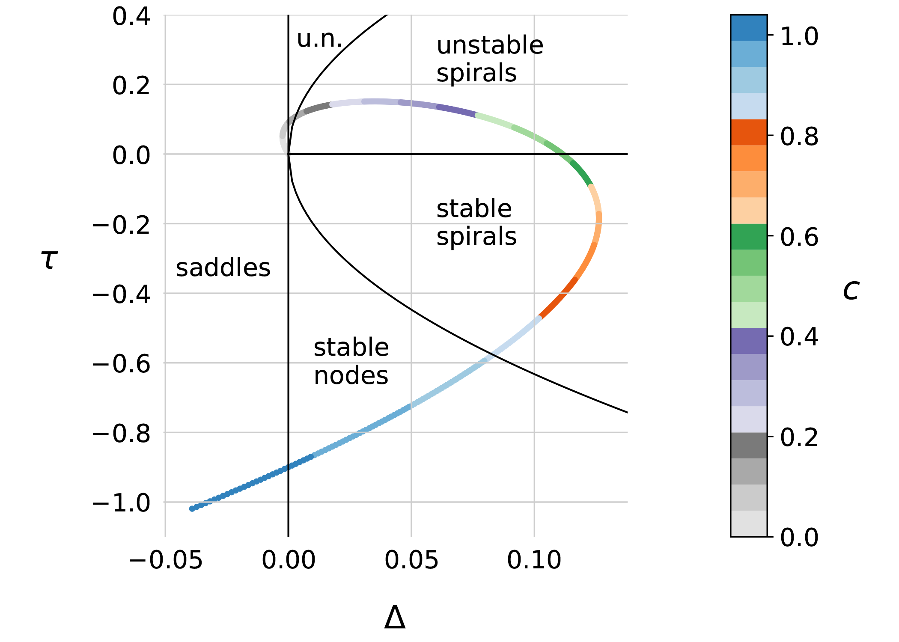
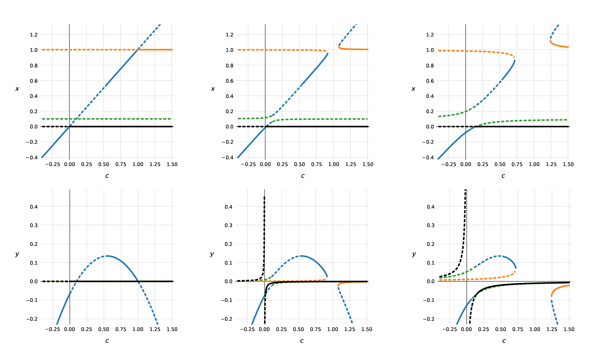
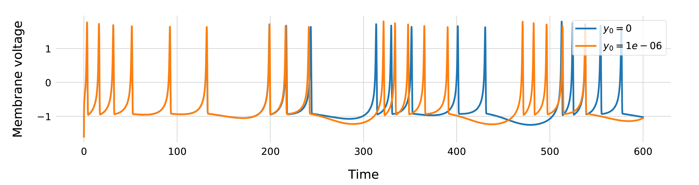
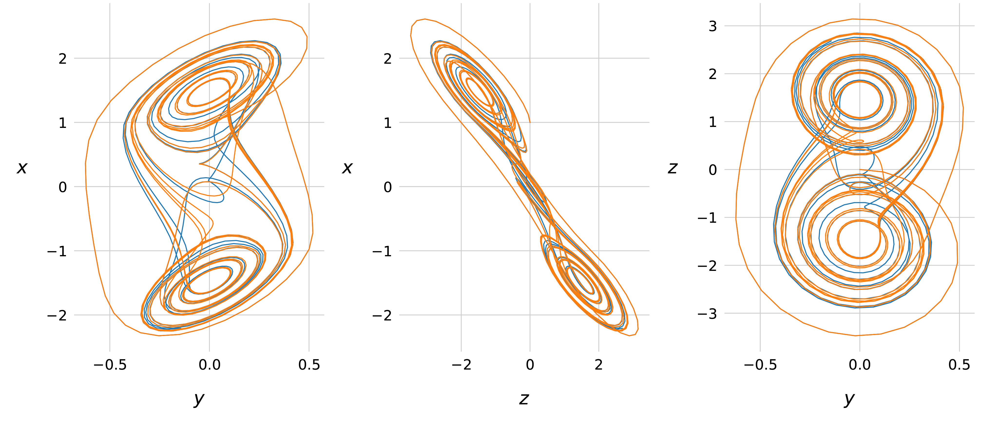

# Strogatz

Notebooks, code, and report for my 
[uni course](https://onderwijsaanbod.kuleuven.be/syllabi/v/e/H0S11AE.htm)
on non-linear dynamical systems.

(Repository named after Steven Strogatz, the mathematician that wrote
[this great book](http://www.stevenstrogatz.com/books/nonlinear-dynamics-and-chaos-with-applications-to-physics-biology-chemistry-and-engineering),
on which the course is based).

Check out the [Report](report/NLS_Report.pdf) and the underlying [Jupyter notebooks](notebooks/).
Note that these might not make much  sense without the [Assignment](Assignment.pdf)
and some background in nonlinear system analysis, as it was explicitly not the goal 
to explain theory or repeat the assignment.

Or simply check out some figures below:

_Phase space portraits of a predator-prey model, for different predator decay rates **c**.
(Normalised prey amount on the x-axis, normalised predator amount on the y-axis. Coloured dots represent fixed points.
Basins and curves of attraction are coloured according to their attracting fixed point. The purple orbit is a limit cycle)._

 
 
 
 
 

<em>Linear stability analysis of one fixed point (coloured blue in the phase portraits above), for different values of c.
For this analysis, we calculate the Jacobian of the system equations, and evaluate it at the fixed point.
The eigenvalues of this matrix determine the local behaviour of the fixed point. For 2D systems, they are
usefully summarised by the determinant (Δ) and the trace (τ) of the Jacobian.</em>

 
 
 
 
 

<em>System behaviour for different values of a parameter (here: c) can be summarised
in a so called bifurcation diagram. The bifurcation diagrams in the left hand column
correspond to the phase portraits and stability diagram shown above
(dashed lines are unstable fixed points, solid lines are stable fixed points.
Branches are coloured according to their fixed point; same colours as in the first figure above).
The bifurcation diagrams in the center and right columns depict systems with an
imperfection parameter present (middle: d = 0.001, right: d = 0.01).
In the left hand column (d = 0), 'transcritical bifurcations' are present.
These are switches in stability when branches of different fixed points cross.
The imperfection breaks up these bifurcations.</em>

 
 
 
 
 

<em>Simulations of a neuron model (the 
<a href="https://www.wikiwand.com/en/Hindmarsh%E2%80%93Rose_model">Hindmarsh-Rose model</a>).
In a certain region of parameter space, this model neuron is in "random burst generation" mode,
and the system exhibits so called chaotic behaviour. This means that the system is extremely sensitive
to initial conditions (y0 here).</em>

 
 
 
 
 

<em>Simulations of an electrical circuit with a nonlinear element
(<a href="https://www.wikiwand.com/en/Chua%27s_circuit">Chua's circuit</a>).
This system is also chaotic. Its phase space trajectories
(of which some 2D projections are shown here) end up
on a "double scroll". This is a so called strange attractor:
an attracting fractal with dimension between 2 and 3.</em>

